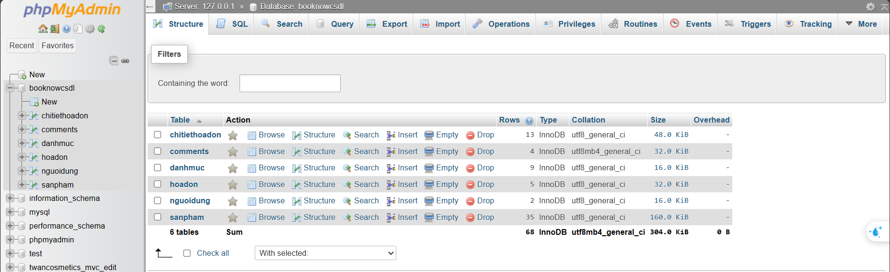
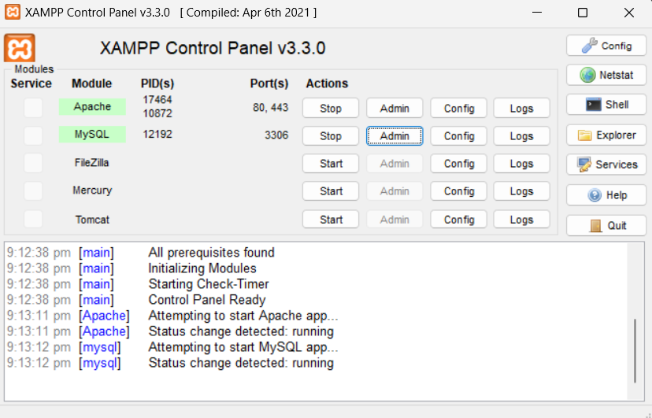
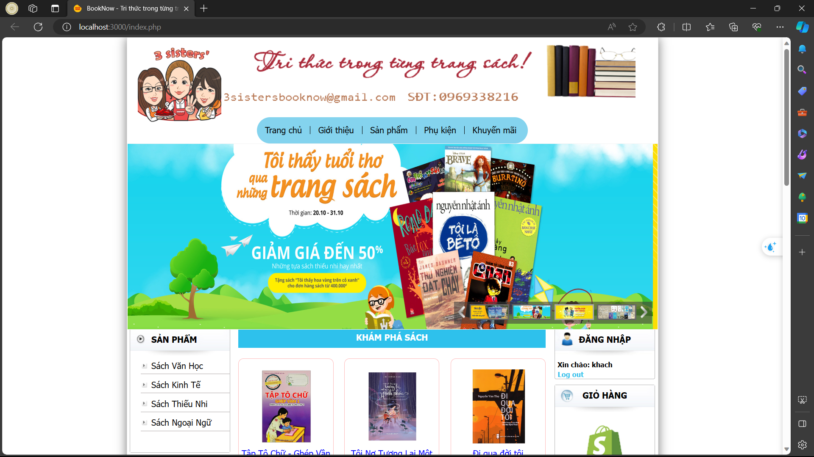
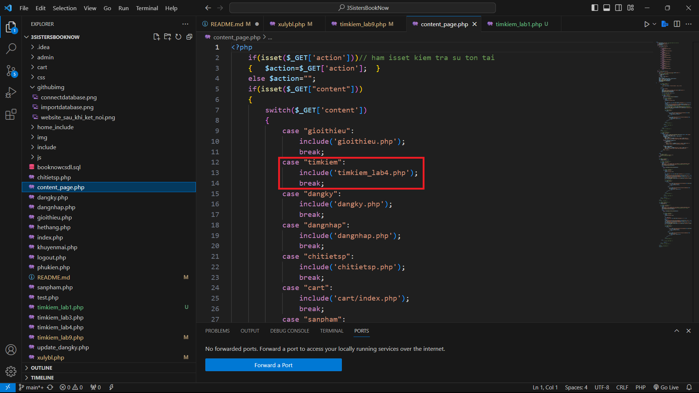
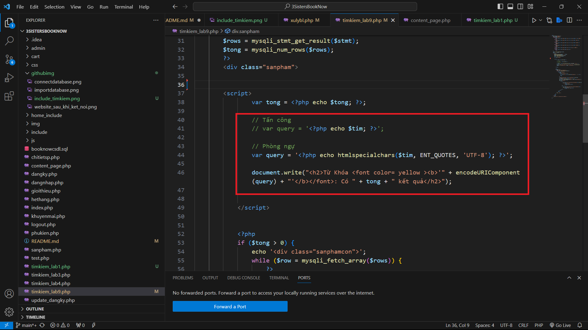
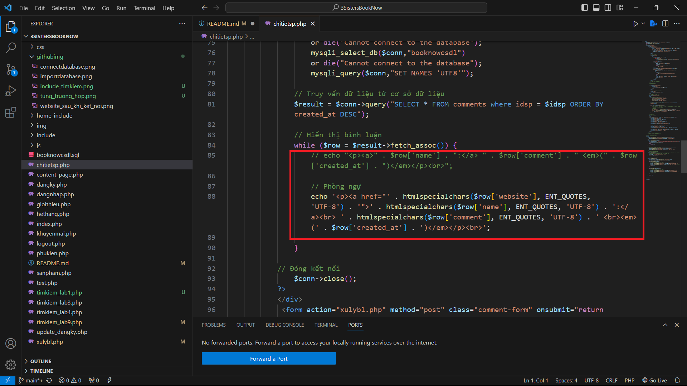
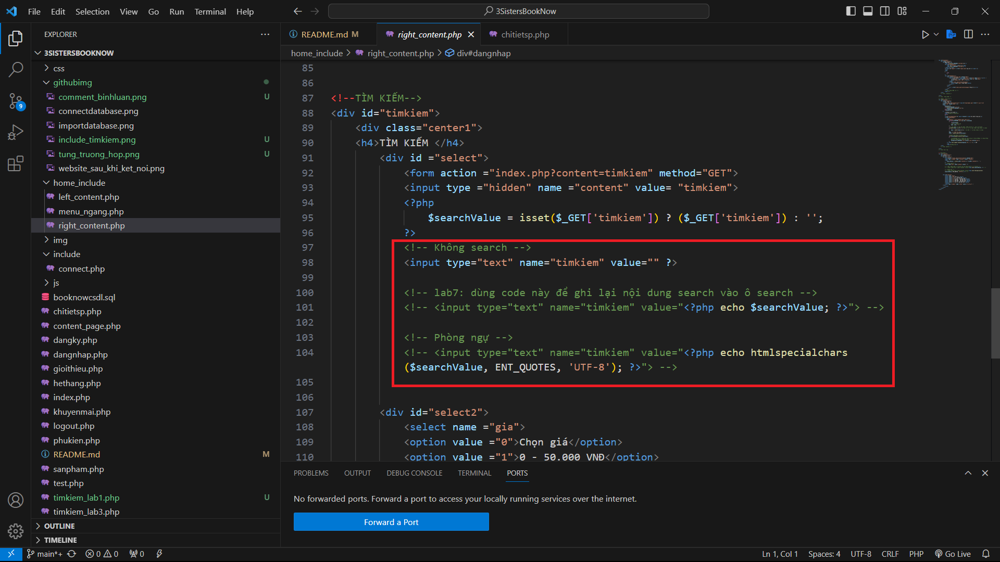

# Minh họa hiện thực XSS trên Website của nhóm

## 1. Yêu cầu môi trường
    . PHP
    . MYSQL
    . VS CODE
## 2. Hướng dẫn cài đặt
### Bước 1: Clone code từ GitHub
    https://github.com/DucTai0909/IS335.O11_20520496_20520743_20520909_20522099.git
### Bước 2: Tạo Database, Import dữ liệu
    - Để tạo Database: mở XAMPP Control Panel -> MySQL -> Admin
    - New -> đăt tên Database là 'booknowcsdl' -> Create
    - Vào Database booknowcsdl -> import -> chọn file booknow.sql
    
    Hình ảnh sau khi imort dữ liệu thành công

### Bước 3: Vào IDE để chạy chương trình
    Để chạy chương trình nhóm sẽ dùng VS Code. Để chạy chương trình trên VS Code ta cần:
    - Cài đặt các Extensions:
        . PHP Server
        . PHP Debug
        . PHP Intelephense
    - Đảm bảo đã kết nối với Database

Ảnh sau khi kết nối với Database

    - Vào file **index.php** -> chuột phải -> PHP Server: Serve project

Ảnh giao diện khi truy cập vào Website

## 3. Hướng dẫn sử dụng cho các bài lab
### Lab 1, 3, 4, 9
    - Bước 1: Vào file [content_page.php](/content_page.php) chỉnh sửa include theo từng bài lab. Ví dụ muốn hiện thực lab1 thì sửa lại thành timkiem_lab1.php. Xem ảnh bên dưới

Ảnh chỉnh sửa file include

    - Bước 2: trong từng file như thế có 2 trường hợp là tấn công và phòng ngự. Nếu muốn hiện thực tấn công ta comment lại code phòng ngự và ngược lại nếu muốn hiện thực phòng ngự ta comment code tấn công lại.

Ảnh của các trường hợp

    - Bước 3: load lại web và hiện thực theo video

### Lab 2, 8
    Truy cập vào file [chitietsp.php](/chitietsp.php)
    - Tấn công: để tấn công cần comment 2 code lại.
        . Thứ 1: comment toàn bộ đoạn <script>
        . Thứ 2: Trong vòng lặp hiển thị bình luận: comment lại đoạn code phòng ngự trong hình phía dưới và bỏ comment dòng lệnh phía trên
        
Comment lại đoạn code phòng ngự

    - Phòng ngự: Làm ngược lại so với trường hợp tấn công
    Cuối cùng load lại web

### Lab 7
    Truy cập vào file [right_content.php](/home_include/right_content.php)
    - Tấn công: Comment lại code phòng ngự
    - Phòng ngự: Làm ngược lại so với trường hợp tấn công
        
Comment lại code tùy theo trường hợp

    Cuối cùng load lại web